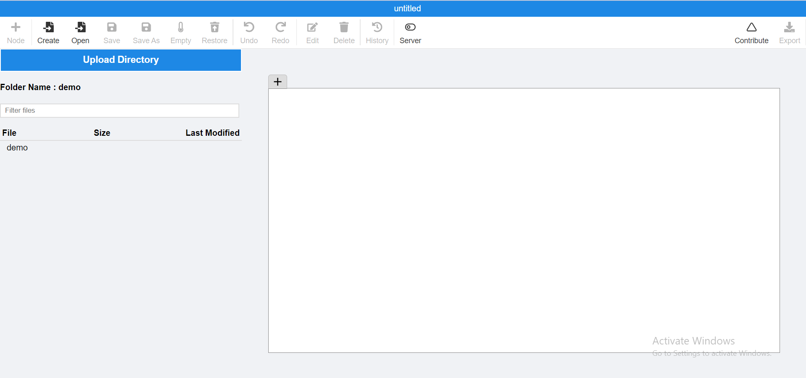
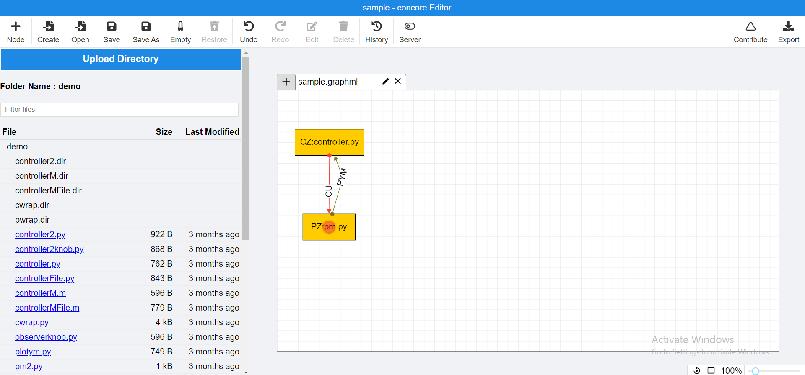
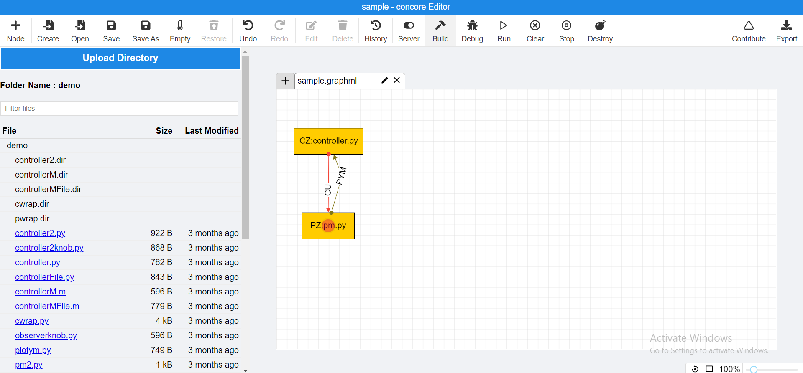
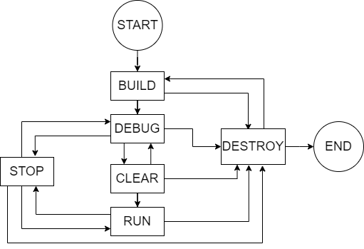

Concore editor
==============

Introduction
------------
Concore Editor is a fork of **DHGWorkflow**, visual Directed Hypergraph Workflow Composer, finetuned to operate as a frontend for concore.

Key Features of the concore Editor:

Export-import graph as a graphml file.
Export graph as JPEG/PNG
Undo-Redo Actions
Drag Drop Nodes
Create Edges easily
Bend Edges
and many more!

How to use?
-----------
- Open **concore editor** by clicking on https://controlcore-project.github.io/concore-editor/ .
- Click on ``Upload Directory`` button and upload the directory containing ``.graphml`` files.

- Now, click on the directory which was uploaded and then click on the ``.graphml`` to open it in workspace.

- Edit the ``.graphml`` as wanted and save it.

- To build the ``.graphml`` file, concore fri(server) needs to be switched on. To do so: 

First, clone the ``concore`` repository from https://github.com/ControlCore-Project/concore.

.. code-block:: console
 
 $ cd concore
 
 $ pip install -r requirements.txt

 $ cd fri

 $ cd server

 $ python main.py

It will start the Flask server.

- After switching on the server, click on the ``server`` button in ``concore editor``'s tab bar. You will see all the concore functions appearing there.

- Last step is to perform concore functions on opened ``.graphml`` in order given in below flowchart.

  
**Note:** Executing concore functions in different order can result in errors and breakages. 