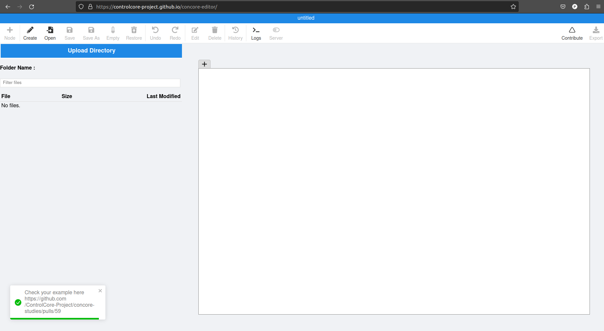

The Concore Action
==================

Introduction
------------
This feature makes it easy for users to share their studies, examples, and program files. With this feature, you can contribute your study without having to use GitHub.

How to use?
-----------

1. Creating a new Study
-----------------------

Using concore editor:

- Open **concore editor** by clicking on https://controlcore-project.github.io/concore-editor/

- Click on ``Contribute`` button at top-right of the editor

- To contribute examples, concore fri(server) needs to be switched on. To do so refer https://control-core.readthedocs.io/en/latest/concoreeditor.html#how-to-use

- Fill in the details as follow:-
    These are the necessary arguments
        - Study Name - title of the study
        - Study Path - full directory path where the study is located as shown below.
        - Author Name - name of the person who created that study

    You can also provide the ``optional`` arguments by clicking  ``Show Advance Options`` button
        - Branch Name - the branch name you want 
        - Title of Study - a short title which will displayed as title of pull request at github
        - Description of Study - a description which will be displayed as body of the pull request at github

``Note: If you are not familiar with Github, we recommend you to skip the optional fields``

``Tip: To copy the file path , follow this right-click on the file > click on copy path``

- Click on ``Generate PR`` button and wait until it processes your request

- After it gets completed, you can check at the link given in the message

Using command-line tools:
-------------------------

- pass the above mentioned arguments to the ``contribute`` command

``./contribute <Study-Name> <Full-Path-To-Study> <Author-Name> <Branch-Name> <PR-Title> <PR-Body>``

- e.g: 

``./contribute heart F:\example parteek heart-study "Added heart study"``

It will create a Pull request authored by parteek, on a new branch named heart-study with title "Added heart study"

2. Updating existing Study
--------------------------

- Make the changes in your local study

- Again create the PR either using concore-editor or CLI. Make sure the values for Author name, Study Name and Branch name (if entered before) should be the same as you entered before while contributing study

``Note: Successful submission doesnot mean that your study is added to our repository, It will take time for us to review and accept the study.So, you can mention your email in the description field mentioned above so that if your study got accepted then we will let you know.``
