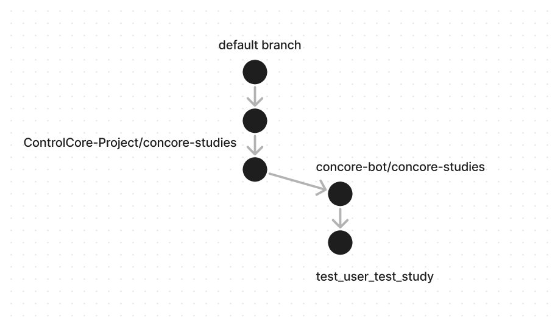

The Concore Action Dev docs
===========================

Introduction
------------

The current implementation uses Github REST API to push code to github by authenticating with github fine grained access token (refer https://github.blog/2022-10-18-introducing-fine-grained-personal-access-tokens-for-github/)

How it works
------------

- On triggering ``contribute`` action in fri server, it executes the ``contribute.py`` script

- Let's assume the paramters provided are:
    - Study Name - test study
    - Study Path - F:\\example
    - Author Name - test user

- It will create a new branch named ``AuthorName_StudyName`` i.e test_user_test_study in the bot repository ``concore-bot/concore-studies`` which references the default branch in ``ControlCore-Project/concore-studies``

- Now creating Github blob (refer https://docs.github.com/en/rest/git/blobs ) for each file in the directory here ``F:\\example``. After creating blobs , create a new Git tree (refer https://docs.github.com/en/rest/git/trees)

- After creating Github tree, change the refrence of the newly created branch to the that tree

- Now the changes have been pushed to github, and for creating pull request the  ``pull_request.yml`` workflow is runned which creates pull request to upstream repo using persoanl access token of upstream repo

``Note: You need to store the personal access token of upstream repo as github secret in bot repo``

Creating token for bot
----------------------

This token is used to create branches and push studies to bot repo.After pushing studies to bot repo it dispatch ``pull_request.yml`` workflow.

- Open the ControlCore-Project account at github and navigate as follow:

  
  settings >  Developer settings > Personal access token > Fine-grained access token > Generate New token

  Or 

  click https://github.com/settings/personal-access-tokens/new

- Fill token name,description expiration time

- Under the ``Repository access`` section select ``Only select repositories`` to select the repository for which you want to provide the access

- Under the ``Permissions`` , provide the read-write permissions for **Contents** and **Actions** in the ``Repository permission``

- Click **Generate token** button

- Then copy the generated token and hash it using this website in base64 encoding http://www.unit-conversion.info/texttools/base64/ . Note this hashing is important as Github automatically revoke any token present in the code.

- Place the token in ``contribute.py`` script at https://github.com/ControlCore-Project/concore/blob/dev/contribute.py#L7 

``Note: This token has max life time of 1 year and needs to be updated after this duration``

Creating token for workflow
---------------------------

This token is used to create pull request to upstream repo using bot account as author of pull request.

- Open ``concore-bot`` account at Github

- Create a  Personal access token of bot account at https://github.com/settings/tokens/new

- Fill the details as shown below:

- Click ``Generate token`` at bottom of the page , then Copy the token

- Add this token as Github secret in bot repo at https://github.com/concore-bot/concore-studies/settings/secrets/actions/new with name ``token`` 

- Click ``Add secret``

``Note: This token can have unlimited life span so it is just one-time setup``

Architecture
------------
- When ``contribute`` action is triggered it pushes local study to ``concore-bot/concore-studies`` repository

- After pushing study to Github , it creates a pull reuqest for that study to the ``ControlCore-Porject/concore-studies`` repository

- Unitl the Pull reuqest is merged or closed this branch serves as staging area

``Optional:- If you want to explore why we came up with this approach , please refer https://docs.google.com/document/d/1DdmPO51qOb9OQoiQ4RMH-3O80gxrGWJuHc9QV_AlW0U/edit?usp=sharing``