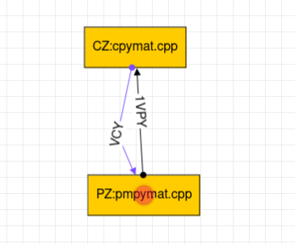
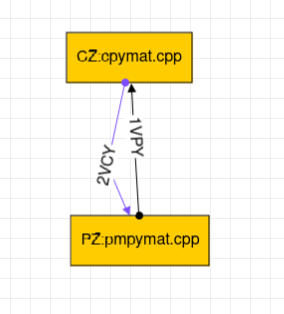
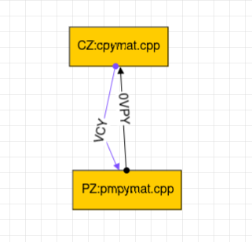
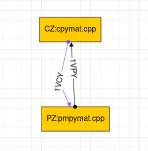

Shared Memory communication in Concore
===============================================

**Shared memory** is a form of inter-process communication (IPC) 
in computer systems where multiple processes can access and 
exchange data directly from a common memory space. 
It allows processes to communicate and share information efficiently 
without the need for intermediate data storage like files. 

Advantages of Shared Memory over File Sharing
---------------------------------------------

- **Speed:** Shared memory is typically faster than file sharing because data is directly accessible in memory, eliminating the overhead of reading and writing to files. In file sharing, data needs to be written to disk, and the file system overhead can slow down data access.

- **Efficiency:** Since there is no need to read or write data to and from disk, shared memory reduces the CPU and I/O overhead, resulting in more efficient data exchange between processes.

- **Simplicity:** Shared memory is straightforward to implement and use compared to file sharing, where you need to handle file open/close, read/write operations, and ensure proper data integrity.

- **Scalability:** Shared memory can be more scalable in certain situations as it reduces the need for the operating system to manage file I/O, especially when dealing with a large number of processes accessing the same data frequently.

- **Reduced Disk Space Usage:** In file sharing, temporary files might need to be created, and they consume disk space. Shared memory doesn't require creating any extra files, reducing disk space usage.

Usage or Activate Shared Memory in Concore
------------------------------------------

- Need to pass information in the edge in graphml.
- To achieve this, ensure that each edge starts with a positive number greater than 0.
- By following these guidelines, Concore will automatically facilitate data exchange between the relevant components using shared memory.
- Additionally, remember **not to repeat the same positive number** as a prefix for different edge names.

Cases
-----

- Case 1:- PZ writes in Shared Memory (key = 1) and reads from file. CZ writes in file and read from same Shared Memory.

- Case 2:- PZ writes in Shared Memory (key = 1) and reads from Shared Memory (key = 2). CZ writes in Shared Memory (key = 2) and read from Shared Memory (key = 1).

- Case 3:- CZ and PZ use file method for communication.

- Case 4:- Not a valid case.

