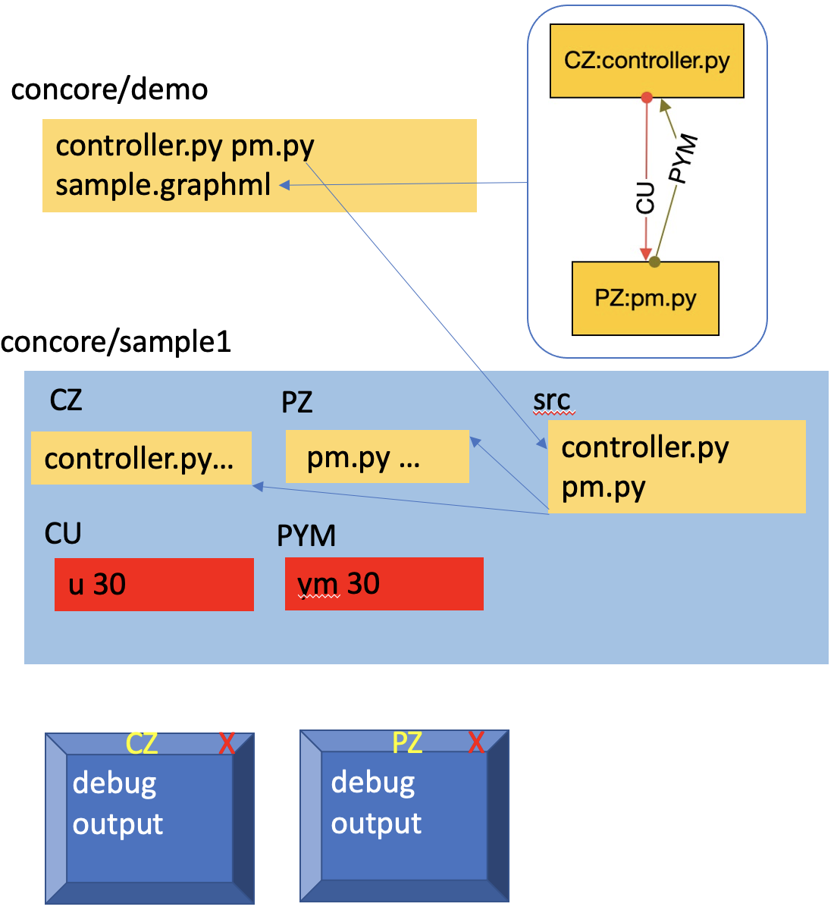

Usage
=====
.. _introduction:
.. _programs:
.. _workflows:

Introduction
------------

CONTROL-CORE is a framework for peripheral neuromodulation control systems, which consist of models of organs called physiological models (PMs) and controllers that interact with PMs. The controller and the PM are represented by workflow diagrams (.graphml) that indicate how they are connected together. Nodes in the workflow diagram are programs that are written using the ``concore`` protocol. Edges in the workflow diagram show how the nodes are interconnected. To create a system with ``concore``, you need to write at least two programs (or use existing programs) that are referrenced in the workflow diagram. These programs need to use the ``concore`` methods to receive and transmit neurostimulation data and response.

To develop workflows in the CONTROL-CORE framework, one must go through two steps. First, to develop the programs following the ``concore`` protocol. Second, is to create a workflow from the created programs. 

Writing ``concore`` Programs
------------
.. role:: raw-html(raw)
   :format: html
The ``concore`` protocol requires the developer (the application developer who develops programs to run on the CONTROL-CORE framework) to split one :raw-html:`program` into separate :raw-html:`controller` and :raw-html:`PM` programs.

.. image:: images/split-sample.png
  :width: 500
  :alt: Splitting into controller and PM programs
  
  
Now, let's look into how to split an existing program to use ``concore`` as specified above, with a minimal example.  
 
Adapting your program to use ``concore`` protocol
------------ 
 
First, let's consider the below simple program, that does not adhere to the ``concore`` protocol, and appears as a "Combined program" with both PM and controller methods in it.

Combined program (non-``concore``) 
######################## 

.. role:: raw-html(raw)
   :format: html
:raw-html:`import numpy as np `
:raw-html:`ysp = 3.0 `
:raw-html:`def controller(ym):  `
:raw-html:`  if ym[0] < ysp: `
:raw-html:`     return 1.01 * ym `
:raw-html:`  else: `
:raw-html:`     return 0.9 * ym `
:raw-html:`def pm(u): `
:raw-html:`  return u + 0.01 `
:raw-html:`ym = np.array([[0.0]])  `
:raw-html:`u = np.array([[0.0]]) `
:raw-html:`for i in range(0,150): `
:raw-html:`  u = controller(ym) `
:raw-html:`  ym = pm(u) `
:raw-html:`  print(" u="+str(u)+ " u="+str(ym)) `

The above simple code represents your existing program that does not adhere to ``concore`` protocol. That means, it consists of :raw-html:`controller` and :raw-html:`PM` methods in a single integrated program.

Now, let's see how to break this into two different ``concore`` programs, each representing :raw-html:`controller` and :raw-html:`PM.` You must have noticed we have been conistently using colors in our code samples. They have a meaning.

Code segments that represent the :raw-html:`controller` methods are in :raw-html:`green`.

Code segments that represent the :raw-html:`PM` methods are in :raw-html:`red`.

Code segments that are specific to your application, and not specific to your PM or controller are in :raw-html:`blue`. These segments will likely end up in your both ``concore`` PM and controller programs as we will see shortly.

Separated into ``concore`` programs
######################## 

Let's convert the above program to use ``concore`` now. ``concore`` specific code segments are in black in the two ``concore`` programs (controller and PM) displayed below.

**The Controller**

The respective ``concore`` controller:

.. role:: raw-html(raw)
   :format: html
:raw-html:`   # controller.py `
:raw-html:`import numpy as np `
:raw-html:`import concore `
:raw-html:`ysp = 3.0 `
:raw-html:`# controller function `
:raw-html:`def controller(ym):  `
:raw-html:`  if ym[0] < ysp: `
:raw-html:`     return 1.01 * ym `
:raw-html:`  else: `
:raw-html:`     return 0.9 * ym `
:raw-html:`# main `
:raw-html:`concore.default_maxtime(150) `
:raw-html:`concore.delay = 0.02 `
:raw-html:`# initial values -- transforms to string including the simtime as the 0th entry in the list `
:raw-html:`init_simtime_u = "[0.0, 0.0]" `
:raw-html:`init_simtime_ym = "[0.0, 0.0]" `
:raw-html:`u = np.array([concore.initval(init_simtime_u)]).T `
:raw-html:`while(concore.simtime < concore.maxtime)     while concore.unchanged():         ym = concore.read(1,"ym",init_simtime_ym)     ym = np.array([ym]).T `    
:raw-html:`    u = controller(ym)     print(str(concore.simtime) +     " u="+str(u) + "ym="+str(ym))     concore.write(1,"u",list(u.T[0]),delta=0) `
    
**The PM**

The ``concore`` PM:

.. role:: raw-html(raw)
   :format: html
:raw-html:`   # pm.py `   
:raw-html:`import numpy as np `
:raw-html:`import concore `
:raw-html:`# pm function `
:raw-html:`def pm(u): `
:raw-html:`  return u + 0.01 `
:raw-html:`# main `
:raw-html:`concore.default_maxtime(150) `
:raw-html:`concore.delay = 0.02 `
:raw-html:`# initial values -- transforms to string including the simtime as the 0th entry in the list `
:raw-html:`init_simtime_u = "[0.0, 0.0]" `
:raw-html:`init_simtime_ym = "[0.0, 0.0]" `
:raw-html:`ym = np.array([concore.initval(init_simtime_ym)]).T `
:raw-html:`while(concore.simtime < concore.maxtime)     while concore.unchanged():         u = concore.read(1,"u",init_simtime_u)     u = np.array([u]).T `    
:raw-html:`    ym = pm(u)     print(str(concore.simtime) +     " u="+str(u) + "ym="+str(ym))     concore.write(1,"u",list(u.T[0]),delta=1) `

The concore Git repository comes with some samples. The above controller.py and pm.py can be found in the demo directory. The demo directory also comes with other sample controller and pm implementations, and workflows that connect them - stored as GraphML files.

Building Workflows with ``concore``
------------

CONTROL-CORE leverages `DHGWorkflow <https://github.com/controlcore-project/DHGWorkflow>`_ to create such workflows graphically. DHGWorkflow is a browser-based lightweight workflow composer, which lets us visually create directed hypergraphs (DHGs) and save them as GraphML files. ``concore`` consists of a parser that interprets the GraphML files created by DHGWorkflow into workflows consisting of ``concore`` programs that interact with each other in a DHG.

``concore`` comes with a set of samples in the demo directory. As a learning exercise, these samples do not have the actual physiological models and controllers. Rather, they demonstrate the ``concore`` protocol with minimal complexity.
 
Let's run a sample workflow!

First, use your favorite editor to create controller and pm or use the existing controller.py and pm.py in the demo directory (elaborated in the above section). Similarly, a sample workflow with the above sample controller.py and pm.py is also saved in the demo directory as sample.graphml in the demo directory. The demo directory also has several other controller, pm, and workflow sample implementations. 

Let's go to the demo directory to compose and edit the workflows.

``$ cd demo``

Then, use the editgraph command to pop up the browser and open DHGWorkflow to create a graphml file, similar to the one demonstrated below. The below commands are specific to POSIX (Linux/MacOS) environments. If you use Windows, please make sure to use ``\`` instead of ``/``.

``../editgraph``

.. image:: images/dhg-sample.png
  :width: 400
  :alt: DHG Sample

  
Use the "Save As" option and type "sample1." That will save the workflow as sample1.graphml in your Downloads directory.

Now, use the getgraph command to copy the graphml files from your Downloads directory to the current directory.

``../getgraph``

This copies "sample1.graphml" to current directory "demo".

 
Now, go back to main ``concore`` directory to build the study that uses the programs referenced by the workflow.

``cd ..`` 

Run the makestudy command of ``concore`` which creates files and folders necessary for the workflow execution.

``./makestudy demo/sample1``

This would create  a "sample1" directory with a first copy of the source files in "src". 

Go to the sample1 directory.

``cd sample1``

Now, run the build command, which functions like a compiler.

``./build``	

This, 

* creates CZ directory corresponding to node and copies controller.py into CZ. 

* creates PZ directory corresponding to node and copies pm.py into PZ.  

* creates CU and PYM directories corresponding to the edges of the graph. 

The below diagram demonstrates the files and folders after running the build command. The dashed arrows indicate the multiple copies of files that are being used.

Now, set a maxtime attribute to list the number of iterations to be made by the controller and the PM.

``./maxtime 30``

This copies 30 into edges so both programs finish at the same time
   
Next, use debug command to execute the workflow.

``./debug``	

The debug windows pop up.

Remember to close the debug windows with mouse, once the results are obtained.

Instead of debug, you may use the run command to execute the workflows without debug windows.

``./run``

At last, clean up the resources with the below commands.

``./stop``	

Executing a stop command is always needed for docker. But it is optional in this example as we did not use Docker.

``./clear``	

Clearing is also always needed for Docker or if rerunning. Again optional in this example.

Finally, you must destroy the sample1 directory, making sure to stop and clear first in Docker executions before using the destroy command.

``cd ..``

``./destroy sample1``

You may see a few error messages and warnings. They are expected and can be safely ignored.
