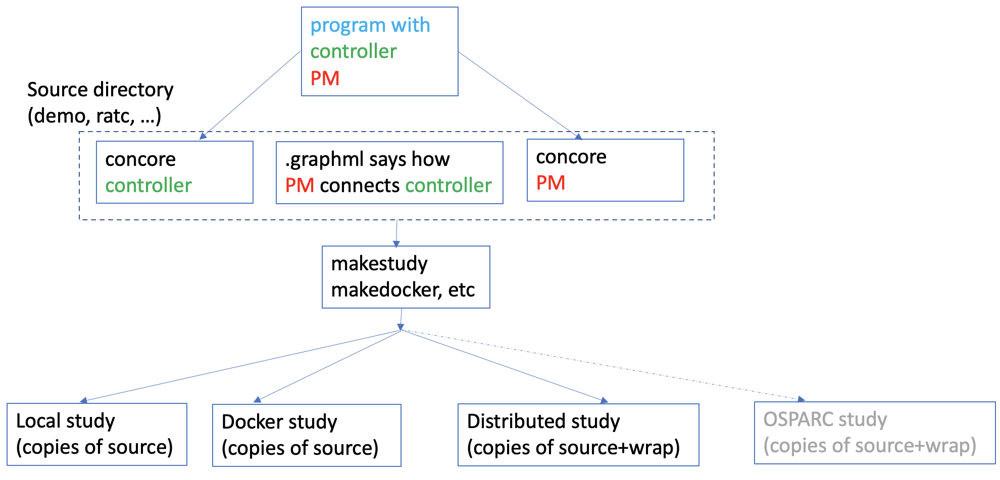
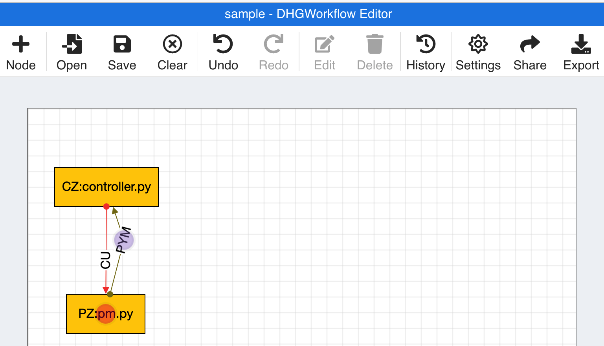

Usage
=====
.. _introduction:
.. _programs:
.. _workflows:

Introduction
------------

CONTROL-CORE is a framework for peripheral neuromodulation control systems, which consist of models of organs called physiological models (PMs) and controllers that interact with PMs. The controller and the PM are represented by workflow diagrams (.graphml) that indicate how they are connected together. Nodes in the workflow diagram are programs that are written using the ``concore`` protocol. Edges in the workflow diagram show how the nodes are interconnected. To create a system with ``concore``, you need to write at least two programs (or use existing programs) that are referrenced in the workflow diagram. These programs need to use the ``concore`` methods to receive and transmit neurostimulation data and response.

To develop workflows in the CONTROL-CORE framework, one must go through two steps. First, to develop the programs following the ``concore`` protocol. Second, is to create a workflow from the created programs. 

Programs
------------
.. role:: raw-html(raw)
   :format: html
``concore`` protocol requires the developer (the application developer who develops programs to run on the CONTROL-CORE framework) to split one :raw-html:`program` into separate :raw-html:`controller` and :raw-html:`PM` programs.

  
  
Now, let's look into how to split an existing program to use ``concore`` as specified above, with a minimal example.  
 
Adapting your program to use ``concore`` protocol
------------ 
 
First, let's consider the below simple program, that does not adhere to the ``concore`` protocol.

.. role:: raw-html(raw)
   :format: html
:raw-html:`import numpy as np `
:raw-html:`ysp = 3.0 `
:raw-html:`def controller(ym):  `
:raw-html:`  if ym[0] < ysp: `
:raw-html:`     return 1.01 * ym `
:raw-html:`  else: `
:raw-html:`     return 0.9 * ym `
:raw-html:`def pm(u): `
:raw-html:`  return u + 0.01 `
:raw-html:`ym = np.array([[0.0]])  `
:raw-html:`u = np.array([[0.0]]) `
:raw-html:`for i in range(0,150): `
:raw-html:`  u = controller(ym) `
:raw-html:`  ym = pm(u) `
:raw-html:`  print(" u="+str(u)+ " u="+str(ym)) `

The above simple code represents your existing program that does not adhere to ``concore`` protocol. That means, it consists of :raw-html:`controller` and :raw-html:`PM` methods in a single integrated program.

Now, let's see how to break this into two different ``concore`` programs, each representing :raw-html:`controller` and :raw-html:`PM.` You must have noticed we have been conistently using colors in our code samples. They have a meaning.

Code segments that represent the :raw-html:`controller` methods are in :raw-html:`green`.

Code segments that represent the :raw-html:`PM` methods are in :raw-html:`red`.

Code segments that are specific to your application, and not specific to your PM or controller are in :raw-html:`blue`. These segments will likely end up in your both ``concore`` PM and controller programs as we will see shortly.

Let's convert the above program to use ``concore`` now. ``concore`` specific code segments are in black in the two ``concore`` programs displayed below.

The respective ``concore`` controller program:

.. role:: raw-html(raw)
   :format: html
:raw-html:`import numpy as np `
:raw-html:`import concore `
:raw-html:`ysp = 3.0 `
:raw-html:`def controller(ym):  `
:raw-html:`  if ym[0] < ysp: `
:raw-html:`     return 1.01 * ym `
:raw-html:`  else: `
:raw-html:`     return 0.9 * ym `
:raw-html:`concore.default_maxtime(150) `
:raw-html:`concore.delay = 0.02 `
:raw-html:`init_simtime_u = "[0.0, 0.0]" `
:raw-html:`init_simtime_ym = "[0.0, 0.0]" `
:raw-html:`u = np.array([concore.initval(init_simtime_u)]).T `
:raw-html:`while(concore.simtime<concore.maxtime): `
:raw-html:`    while concore.unchanged(): `
:raw-html:`        ym = concore.read(1,"ym",init_simtime_ym) `
:raw-html:`    ym = np.array([ym]).T `    
:raw-html:`    u = controller(ym) `
:raw-html:`    print(str(concore.simtime) +     " u="+str(u) + "ym="+str(ym)); `
:raw-html:`    concore.write(1,"u",list(u.T[0]),delta=0) `
    

``concore`` methods 
########################

Workflows
------------

CONTROL-CORE leverages `DHGWorkflow <https://github.com/controlcore-project/DHGWorkflow>`_ to create such workflows graphically. DHGWorkflow is a browser-based lightweight workflow composer, which lets us to visually create directed hypergraphs (DHGs) and save them as GraphML files. ``concore`` consists of a parser that would interpret the GraphML files created by DHGWorkflow into workflows consisting of ``concore`` programs that interact with each other in a DHG.

